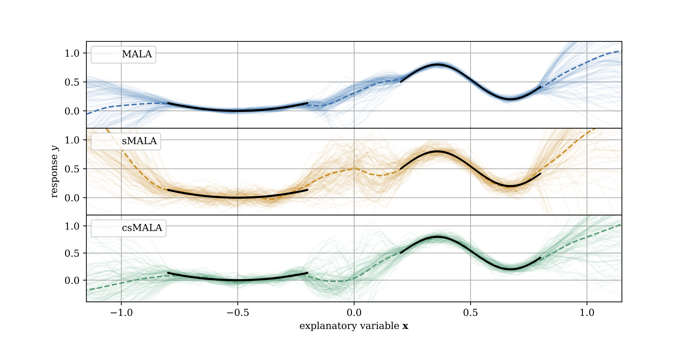
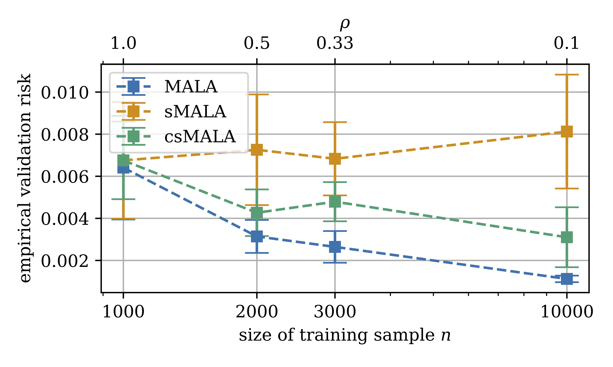

# csMALA

This Repo contains the Numerics of our Paper ["Statistical guarantees for stochastic Metropolis-Hastings"](https://arxiv.org/abs/2310.09335). 
This includes an implementation of a stochastic Metropolis Adjusted Langevin Algorithm (MALA) drawing auxiliary variables from a Bernoulli distribution $b_i \sim \mathrm{Ber}(\rho)$ for some $\rho\in (0,1]$ to construct batches of data.




For a simple 1D Regression example $\mathcal{D}_n = (x_i,y_i)_{i\in 1,...,n}$, we use a $L_2$-loss 
$$
  L_n(\vartheta, B) = L(\vartheta, B; \mathcal{D}_n) := \frac{1}{n\rho}\sum_{i=1}^n b_i \underbrace{(y_i - f_\vartheta(x_i))^2}_{=: l_i(\vartheta)}
$$
at function parameters $\vartheta$.
In combination with established MALA, this leads to sampling from a surrogate distribution, which only resembles the true posterior well for large $\rho$ and $n$.

We propose adapting the loss to 
$$
  \tilde{L}_n(\vartheta, B) := \frac{1}{n}\sum_{i=1}^n b_i l_i(\vartheta) + \zeta \frac{\log{\rho}}{\lambda} \sum_{i=1}^n b_i\,,
$$
which ensures sampling from a marginal invariant distribution with reduced inverse temperature of $\frac{\lambda}{1-\rho}$ for small $\frac{\lambda}{n}$ compared to the true posterior. The convergence of the resulting algorithm in Kullback-Leibner-Divergence does no longer depent on the batchsize $\rho$ and resembles that of full data MALA.

<div style="text-align: center;">
  
</div>

## Structure

* <code>src/MALA.py</code> defines our MALA implementation and can by used in exchange for your usual PyTorch Optimizer
* <code>src/util</code> contains the risk implementations, including our corrected risk term, as well as the model definition
* <code>src/datasets</code> contains toy data und Bernoulli-sampling Dataloader
* <code>src/uncertimators</code> contains wrappers around  MALA and propabilistic training for easier use

## Basic Usage

Minimal working examples of the data generation, Neural Network definition and weight sampling with MALA are provided in the first half of<code>StochasticMH.ipynb</code>. The second half of the Notebook contains the plotting scripts for the figures displayed in the paper.

To generate the weight samples requiered for plotting <code>StochasticMH.py</code> and <code>StochasticMH_Adam_baseline.py</code> need to be executed for different $\rho$ and $n$. To this end both scripts accept arguments
  * <code>folder</code>: Path to the directory where the data is loaded from (if existent) and samples are saved. 
  * <code>n_points</code>: Number of data points $n$.
  * <code>rho</code>: Batchsize $\rho$.
  * <code>lambda_factor</code>: Temperature parameter as specified in the paper.
  * <code>sigma_data</code>: Standard deviation of Gaussian noise added to the data in $y$-direction.
  * <code>num_dataloader_workers</code>: Number of threats used for dataloading. <code>default=0</code>

## Citation

For more details, we refer to the [paper](https://arxiv.org/abs/2310.09335)

```bibtex
@unpublished{bieringer2023statistical,
  title={Statistical guarantees for stochastic {M}etropolis-{H}astings},
  author={Bieringer, Sebastian and Kasieczka, Gregor and Steffen, Maximilian F and Trabs, Mathias},
  eprint = "2310.09335",
  archivePrefix = "arXiv",
  primaryClass = "stat.ML",
  month={10},
  year={2023},
  keywords = {bieringer},
}.
```

## Others

Building on this work we developed [AdamMCMC](https://github.com/sbieringer/AdamMCMC). An MCMC tool for weight sampling in Neural Networks leveraging the advantages of the [Adam](https://arxiv.org/abs/1412.6980) optimizer.